# 🚀 Laval Nozzle CFD Analysis (ANSYS Fluent)

This project presents a 2D CFD simulation of compressible flow through a **De Laval nozzle**, performed in **ANSYS Fluent 2025 R1**. The aim was to observe **choked flow** behavior, check **mass conservation**, and compute **wall total force**.

---

## 📘 Description

Initially, a **transient density-based simulation** was attempted using a very small time step (`1e-6`) and 10,000 iterations.
However, due to long computation time and hardware limitations, this approach was aborted after only 3% progress.

The simulation was later **successfully completed as steady-state**, using a **pressure-based SIMPLE algorithm** with 2000 iterations. Convergence was achieved and post-processing results were collected.

---

## 📀 Geometry & Boundary Conditions

* **Length**: 100 mm
* **Height**: 20 mm
* **Inlet Pressure**: 200,000 Pa
* **Outlet Pressure**: 101,325 Pa

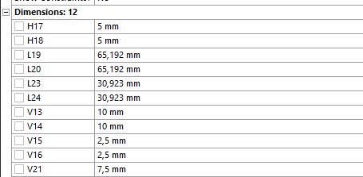
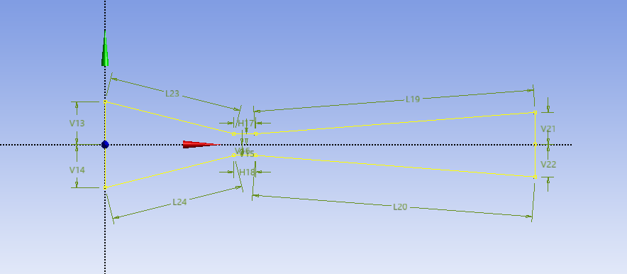

---

## 🤩 Mesh Preview

A structured mesh of approximately 900k elements was used. Boundary layer refinement was applied with biasing near walls.

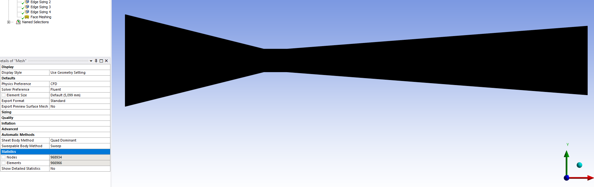

---

## ⚙️ Solver Settings

| Parameter       | Value          |
| --------------- | -------------- |
| Solver Type     | Pressure-Based |
| Simulation Type | Steady         |
| Algorithm       | SIMPLE         |
| Initialization  | Inlet-based    |
| Iterations      | 2000           |


---

## 📊 Mass Flow Rate Analysis (MATLAB)

To verify conservation of mass, the following MATLAB code was used:

```matlab
% Laval Nozzle - Inlet/Outlet Mass Flow Rate Difference

mass_flow_inlet = 2.3634;   % kg/s (from Fluent)
mass_flow_outlet = 2.3514;  % kg/s (from Fluent)

diff = abs(mass_flow_inlet - mass_flow_outlet);
percentage_error = (diff / mass_flow_inlet) * 100;

fprintf('Mass Flow Rate Difference: %.5f kg/s\n', diff);
fprintf('Percentage Error: %.5f%%\n', percentage_error);
```

### ✅ Result:

* **Mass Flow Rate Difference** = `0.0120 kg/s`
* **Percentage Error** ≈ `0.508%`

> 🔍 This minor difference is acceptable in compressible flow simulations and confirms a balanced solution.

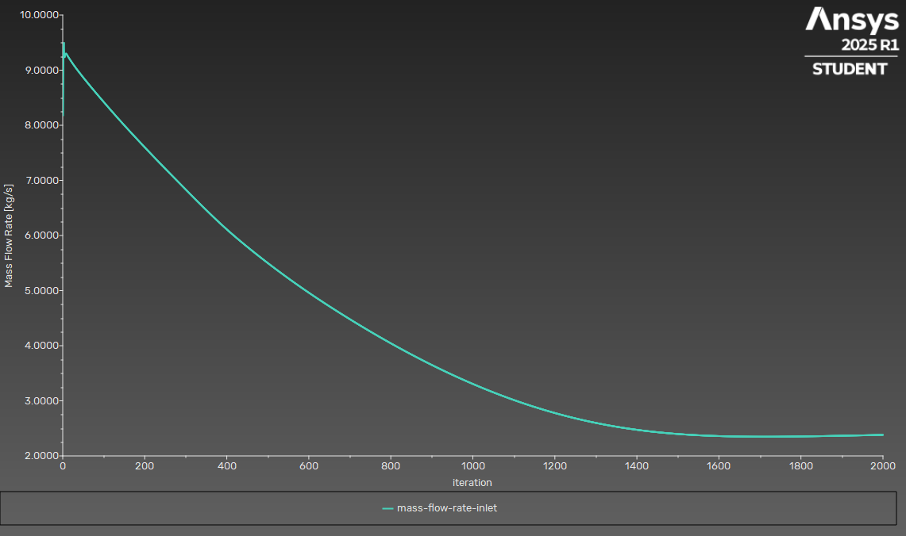
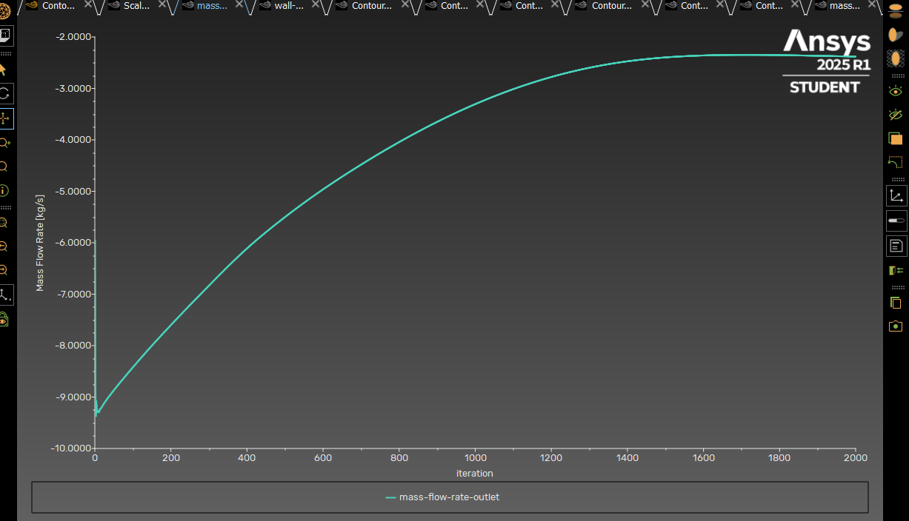

---

## 🧲 Force & Flow Visualizations

| Output                | Value        |
| --------------------- | ------------ |
| Wall Total Force      | \~1745.5 N/m |
| Inlet Mass Flow Rate  | 2.3634 kg/s  |
| Outlet Mass Flow Rate | 2.3514 kg/s  |

### 🔽 Contours & Results:

* **Mach Number**
  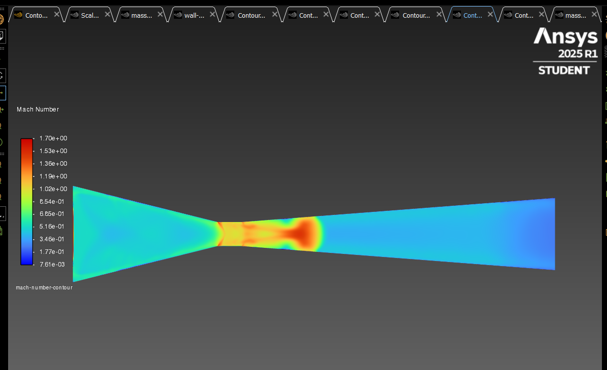

* **Velocity Field**
  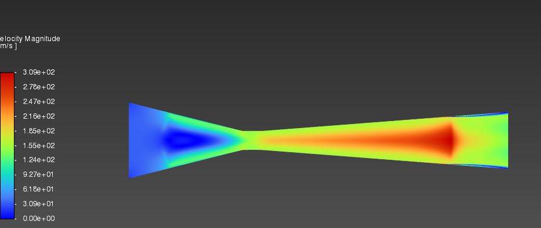

* **Density**
  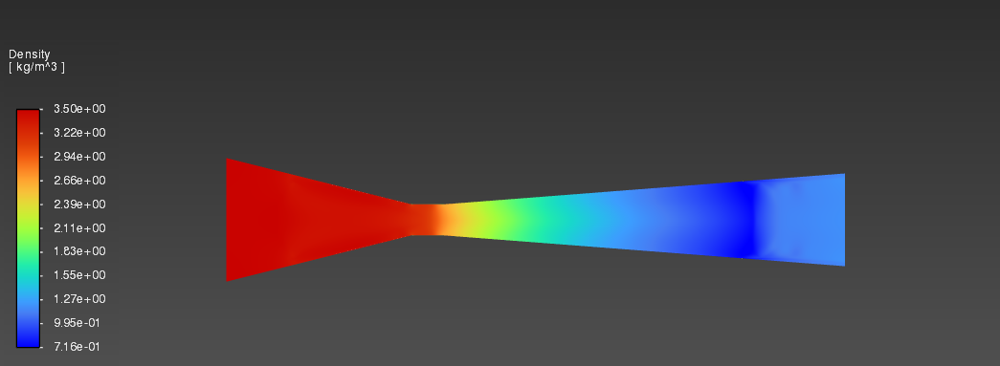

* **Static Pressure**
  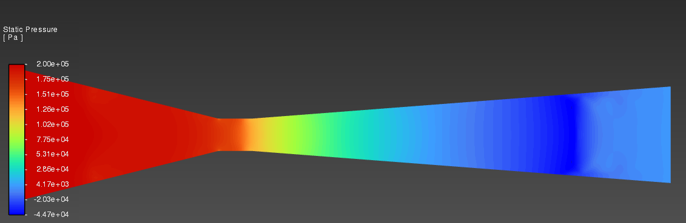
  

* **Static Temperature**
  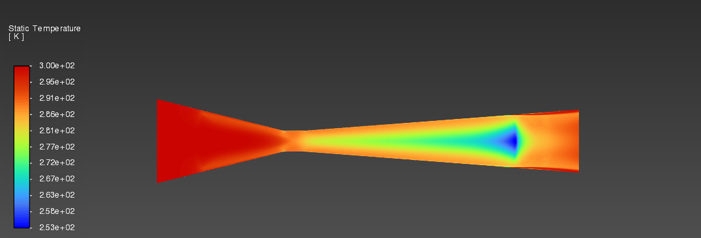

* **Wall Total Force Visualization**
  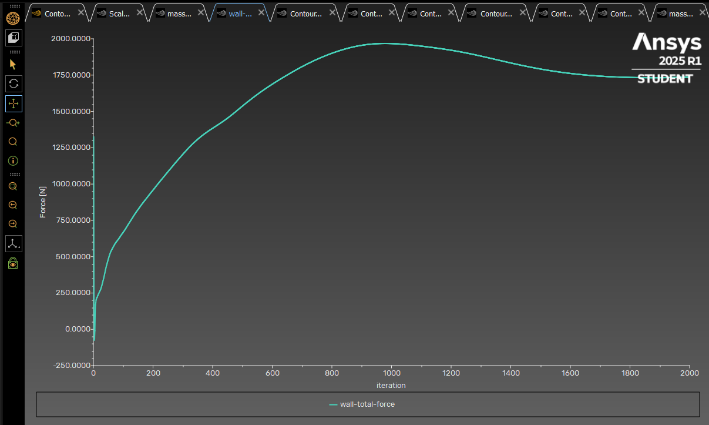

---

## 📂 File Structure

```
LavalNozzle_CFD_Project/
├── README.md
├── lavalNozzle_CFD_Project_geometry.png
├── lavalNozzle_CFD_Project_dimensions.png
├── lavalNozzle_CFD_Project_mesh.png
├── lavalNozzle_CFD_Project_mach_number_contour.png
├── lavalNozzle_CFD_Project_velocity_contour.png
├── lavalNozzle_CFD_Project_density_contour.png
├── lavalNozzle_CFD_Project_static_pressure.png
├── lavalNozzle_CFD_Project_static_pressure_close.png
├── lavalNozzle_CFD_Project_static_temperature.png
├── lavalNozzle_CFD_Project_scaled_residuals_steady.png
├── lavalNozzle_CFD_Project_wall_total_force.png
├── lavalNozzle_CFD_Project_mass_flow_rate_inlet.png
├── lavalNozzle_CFD_Project_mass_flow_rate_outlet.png
└── MATLAB_mass_flow_diff.m
```

> 🧐 Created by Burak Yorukcu
> 💻 Software: ANSYS Fluent 2025 R1 & MATLAB


---
