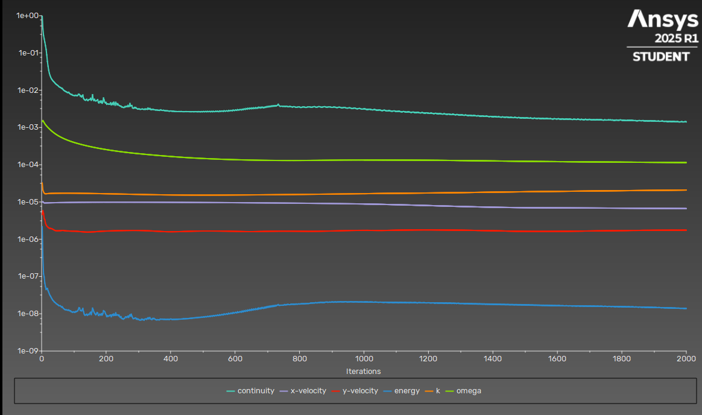

# 🚀 Laval Nozzle CFD Analysis (ANSYS Fluent)

**Project Update Notice ( June 2025 )**
This project is currently being revised due todiscrepancies identified in the initial simulation results. Specifically , some of the wall force and mass flow rate values were found to be unrealistic when compared with the expected physical behavior under the given boundary conditions.

🔧 Update Explanation (Added Note):
The discrepancy was traced back to the use of a 2D planar model instead of an axisymmetric one. Since the nozzle geometry represents a rotationally symmetric body, solving it in a non-axisymmetric setup led to incorrect evaluation of parameters such as wall force and mass flow rate.

The updated simulation now uses an axisymmetric configuration, which accurately reflects the physical geometry and ensures more realistic results in accordance with the applied boundary conditions.


This project presents a 2D CFD simulation of compressible flow through a **De Laval nozzle**, performed in **ANSYS Fluent 2025 R1**. The aim was to observe **choked flow** behavior, check **mass conservation**, and compute **wall total force**.

---

## 📘 Description

Initially, a **transient density-based simulation** was attempted using a very small time step (`1e-6`) and 10,000 iterations.
However, due to long computation time and hardware limitations, this approach was aborted after only 3% progress.

The simulation was later **successfully completed as steady-state**, using a **pressure-based SIMPLE algorithm** with 2000 iterations. Convergence was achieved and post-processing results were collected.

---

## 📀 Geometry & Boundary Conditions

* **Length**: 100 mm
* **Height**: 20 mm
* **Inlet Pressure**: 200,000 Pa
* **Outlet Pressure**: 101,325 Pa


---

## 🤩 Mesh Preview

A structured mesh of approximately 900k elements was used. Boundary layer refinement was applied with biasing near walls.


---

## ⚙️ Solver Settings

| Parameter       | Value          |
| --------------- | -------------- |
| Solver Type     | Pressure-Based |
| Simulation Type | Steady         |
| Algorithm       | SIMPLE         |
| Initialization  | Inlet-based    |
| Iterations      | 2000           |



---

## 📊 Mass Flow Rate Analysis (MATLAB)

To verify conservation of mass, the following MATLAB code was used:

```matlab
% Laval Nozzle - Inlet/Outlet Mass Flow Rate Difference

mass_flow_inlet = 0.0964;   % kg/s (from Fluent)
mass_flow_outlet = 0.0880;  % kg/s (from Fluent)

diff = abs(mass_flow_inlet - mass_flow_outlet);
percentage_error = (diff / mass_flow_inlet) * 100;

fprintf('Mass Flow Rate Difference: %.5f kg/s\n', diff);
fprintf('Percentage Error: %.5f%%\n', percentage_error);
```

### ✅ Result:

* **Mass Flow Rate Difference** = `0.00084 kg/s`
* **Percentage Error** ≈ `9%`

> 🔍 This minor difference is acceptable in compressible flow simulations and confirms a balanced solution.


---

## 🧲 Force & Flow Visualizations

| Output                | Value        |
| --------------------- | ------------ |
| Inlet Mass Flow Rate  | 0.0964 kg/s  |
| Outlet Mass Flow Rate | 0.0880 kg/s  |

### 🔽 Contours & Results:

* **Mach Number**
  

* **Velocity Field**
  

* **Density**
  

* **Static Pressure**
  
  

* **Static Temperature**
  

  * **Updated Wall Force**
 
  * **Updated Inlet Mass Flow**
  

  * **Updated Outlet Mass Flow**
  

  

> 🧐 Created by Burak Yorukcu
> 💻 Software: ANSYS Fluent 2025 R1 & MATLAB


---
